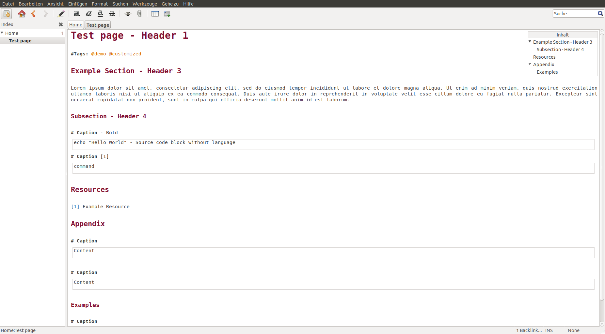

# Theme for Zim Wiki

### Download

Clone complete repository
```bash
git clone https://github.com/GhostActive/zim-theme.git
```
Or download only required *style.conf*
```bash
wget https://raw.githubusercontent.com/GhostActive/zim-theme/master/style.conf
```

### Setup

For Linux - Replace old style: 
```bash
cp style.conf ~/.config/zim/style.conf
```
For Windows - Replace the old style in 
```
%APPDATA%/zim/config/style.conf
```

After restarting zim with new configuration the theme will be activated. For more information about customization, see [official website](https://zim-wiki.org/manual/Help/Config_Files.html).

> **Hint:** "Monospace" is set as default font. Recommanded alternative: [JetBrains Mono](https://www.jetbrains.com/lp/mono/) 

### Sample

The directory "demo/" contains a sample notebook.


